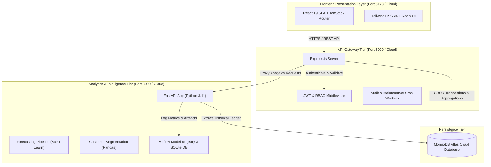

<h1>🛒 ShopSense</h1>
<p>
  <strong>Enterprise Retail Management Platform for Intelligent Inventory Control & Sales Analytics</strong>
</p>
<p>
  A full-stack, microservices-driven e-commerce intelligence ecosystem combining React 19, Node.js/Express, and Python FastAPI to deliver real-time demand forecasting, RFM customer segmentation, automated multi-vendor order routing, and executive business intelligence.
</p>
<p align="center">
  
  
  
  
  
  
  
  
  
  
  
</p>

---

## 📑 Table of Contents

- [🌟 System Highlights](#-system-highlights)
- [🏛️ Architectural Design](#️-architectural-design)
- [✨ Core Capabilities by Role](#-core-capabilities-by-role)
  - [🛍️ Customer Experience](#️-customer-experience)
  - [🏪 Vendor Operations](#-vendor-operations)
  - [👨‍💼 Admin & Executive Suite](#-admin--executive-suite)
- [🤖 Machine Learning & Data Intelligence](#-machine-learning--data-intelligence)
- [🌐 Live Production Deployments](#-live-production-deployments)
- [🔑 Demo Credentials](#-demo-credentials)
- [🚀 Local Quickstart Guide](#-local-quickstart-guide)
- [⚙️ Environment Configuration](#️-environment-configuration)
- [🧪 Testing & Quality Assurance](#-testing--quality-assurance)
- [📂 Project Directory Layout](#-project-directory-layout)
- [📄 License](#-license)

---

## 🌟 System Highlights

- **Multi-Vendor Split-Order Engine**: Automatically dispatches a unified customer cart into discrete vendor sub-orders with independent shipping workflows and ledger tracking.
- **Predictive Demand Forecasting**: Trains time-series regression pipelines against historical sales trends to project 7–30 day product demand, managed via an MLflow model registry.
- **Dynamic RFM Customer Segmentation**: Groups shoppers into actionable behavioral cohorts (*Champions, Loyal, At-Risk, Inactive*) using Recency, Frequency, and Monetary scoring.
- **Enterprise RBAC & Security**: Enforces granular Role-Based Access Control (`customer`, `vendor`, `admin`, `manager`, `staff`) backed by salted BCrypt passwords and cryptographically signed JWTs.
- **Real-Time BI & Telemetry**: Interactive charting dashboards built with Recharts, computing real-time gross merchandise value (GMV), profit margins, and inventory depletion alerts.
- **Automated Audit Logging**: Every administrative action, price change, refund, and transaction is immutably logged into a MongoDB `SystemAudit` ledger.

---

## 🏛️ Architectural Design

ShopSense follows a decoupled, three-tier microservice architecture with asynchronous analytical workers:



---

## ✨ Core Capabilities by Role

### 🛍️ Customer Experience
- **Interactive Marketplace**: Instant search indexing, category filters, and detailed product cards with live inventory checks.
- **Unified Multi-Vendor Cart**: Shop across multiple independent sellers in a single checkout session.
- **Checkout & Payment Channels**: Supports Cash on Delivery (COD) and UPI, generating transaction records and downloadable PDF invoices.
- **Customer Care & Tracking**: Real-time shipment status, order history, and dedicated customer support ticket chat.

### 🏪 Vendor Operations
- **Catalog & Inventory Control**: Add, update, price, and track products with automated low-stock reorder thresholds.
- **Isolated Order Fulfillment**: Vendors inspect and advance orders containing *only their items* (`processing` → `shipped` → `delivered`).
- **Store-Level Analytics**: View dedicated revenue, profit margin breakdowns, and product turnover ratios.
- **ML Demand Projections**: Access product-specific forecasting metrics to order replenishment stock proactively.

### 👨‍💼 Admin & Executive Suite
- **Global Business Intelligence**: High-level dashboard aggregating system-wide GMV, gross margins, and category distributions.
- **User & Vendor Governance**: Approve or deactivate vendor accounts, audit customer activity, and manage administrative privileges.
- **RFM Customer Segmentation**: View dynamic customer cohort charts to formulate targeted marketing and loyalty retention campaigns.
- **Immutable System Audit Trail**: Chronological security ledger tracking sensitive operations across the platform.

---

## 🤖 Machine Learning & Data Intelligence

The dedicated Python FastAPI service houses analytical engines decoupled from the primary web application:

| Pipeline | Technique | Input Data | Target Output |
| :--- | :--- | :--- | :--- |
| **Demand Forecasting** | Ridge / Linear Regression | Historical order velocity & timestamps | Predicted item demand over 7, 14, and 30-day windows |
| **Customer Intelligence** | RFM Quantile Clustering | Order frequency, dates & basket sizes | 5 actionable customer tiers (*VIP, Loyal, At-Risk, etc.*) |
| **Product Recommendation**| Content-Based Categorical Matching | Product attributes & historical baskets | Cross-sell and similar product candidate sets |
| **Financial Margins** | Pandas Vectorized Aggregation | Cost price vs. retail sales totals | Net profit margins & category performance indices |

Model artifacts, hyperparameters, and evaluation metrics (RMSE, MAE) are version-tracked in **MLflow**.

---


## 🚀 Local Quickstart Guide

### Prerequisites
- **Node.js** (v20 or later)
- **Python** (3.11.x recommended)
- **MongoDB** (Local instance or MongoDB Atlas URI)

### 1. Clone the Repository
```bash
git clone https://github.com/Mohan-Sala/Retail-Management-Platform-for-Inventory-Control-and-Sales-Analytics.git
cd Retail-Management-Platform-for-Inventory-Control-and-Sales-Analytics
```

### 2. Configure Environment Files
Create configuration files for the backend and frontend:

**`backend/.env`**:
```env
PORT=5000
NODE_ENV=development
MONGO_URI=YourMongoDBURI
JWT_SECRET=YourSuperSecretKey2026!
FASTAPI_URL=YourFastAPIIURL
FASTAPI_TIMEOUT_MS=Time
```

**`frontend/.env`**:
```env
VITE_API_URL=YourViteAPIURL
```

### 3. Seed the Database
```bash
# From the project root:
cd backend
npm install
node utils/resetDatabase.js
npx tsx utils/seed.ts
cd ..
```

### 4. Run the Three Tiers

#### **Terminal 1: Express Backend Gateway (Port 5000)**
```bash
cd backend
npm run dev
```

#### **Terminal 2: Python FastAPI ML Microservice (Port 8000)**
```bash
cd ml_service
python -m venv .venv
# Windows:
.venv\Scripts\activate
# Linux/macOS:
source .venv/bin/activate

pip install -r requirements.txt
uvicorn app:app --host 0.0.0.0 --port 8000 --reload
```

#### **Terminal 3: React Vite Frontend (Port 5173)**
```bash
cd frontend
npm install
npm run dev
```

Visit **`http://localhost:5173`** to access the store!

---

## ⚙️ Environment Configuration

<details>
<summary><strong>Click to view full Environment Variables Reference</strong></summary>

### Backend (`backend/.env`)
| Variable | Description | Default |
| :--- | :--- | :--- |
| `PORT` | HTTP port for the Node.js server | `5000` |
| `MONGO_URI` | Connection URI for MongoDB | `mongodb://127.0.0.1:27017/shopsense` |
| `JWT_SECRET` | Secret key used for signing authentication tokens | Required |
| `NODE_ENV` | Application environment (`development` / `production`) | `development` |
| `FASTAPI_URL` | Target endpoint of the Python ML microservice | `http://127.0.0.1:8000` |
| `FASTAPI_TIMEOUT_MS` | Proxy request timeout in milliseconds | `10000` |
| `GEMINI_API_KEY` | *(Optional)* Google Gemini key for AI assistant features | `""` |

### ML Microservice (`ml_service`)
| Variable | Description | Default |
| :--- | :--- | :--- |
| `PORT` | Listening port for Uvicorn | `8000` |
| `MONGO_URI` | MongoDB connection URI | Read from `backend/.env` |
| `MONGO_DB_NAME` | Primary database name | `shopsense` |
| `MLFLOW_TRACKING_URI` | SQLite file URI for tracking experiments | `sqlite:///backend/mlruns.db` |

### Frontend (`frontend/.env`)
| Variable | Description | Default |
| :--- | :--- | :--- |
| `VITE_API_URL` | Base URL of the backend API gateway | `http://localhost:5000/api` |

</details>

---

## 🧪 Testing & Quality Assurance

ShopSense includes regression, unit, and load testing scripts:

```bash
# 1. Run Node.js Backend Integration Test Suite
node backend/tests/run_tests.js

# 2. Run Python ML Service Unit Tests (pytest)
pytest ml_service/tests/test_analytics.py -v

# 3. Execute Headless Concurrency Benchmark via Locust
locust -f backend/tests/locustfile.py --headless -u 50 -r 10 -t 1m --host http://localhost:5000
```

---

## 📂 Project Directory Layout

```text
├── backend/                  # Node.js + Express API Gateway
│   ├── config/               # Database and server configs
│   ├── controllers/          # Request handlers & controllers
│   ├── middleware/           # JWT verification, RBAC, and error handlers
│   ├── models/               # Mongoose data schemas (User, Product, Order, etc.)
│   ├── routes/               # Modular Express API route declarations
│   ├── services/             # Transaction workflows & business logic
│   ├── utils/                # Database seeding, reset, & PDF/CSV generators
│   └── server.js             # Application entry point
│
├── ml_service/               # Python 3.11 FastAPI Analytics Microservice
│   ├── ml/                   # Model training, inference, and serialization
│   ├── routes/               # ML endpoints (forecasting, recommendations, RFM)
│   ├── services/             # Vectorized Pandas financial & customer analytics
│   ├── utils/                # Logging, DB pooling, and APScheduler background tasks
│   └── app.py                # FastAPI entry point & Uvicorn runner
│
├── frontend/                 # React 19 Client SPA
│   ├── public/               # Static assets & icons
│   ├── src/
│   │   ├── components/       # Radix UI primitives & custom UI modules
│   │   ├── context/          # Auth and theme context providers
│   │   ├── hooks/            # Custom React Query & business logic hooks
│   │   ├── lib/              # Axios API client & utility helpers
│   │   ├── routes/           # TanStack Router page views & dashboard consoles
│   │   └── router.tsx        # Client route tree definition
│   └── vite.config.ts        # Vite build & bundler configuration
│
└── README.md                 # Project Documentation & Architecture Guide
```

---

## 📄 License

Distributed under the **MIT License**. See `LICENSE` for more information.

---

<p align="center">
  Built with ❤️ by <a href="https://github.com/Mohan-Sala">Mohan Sala</a>
</p>
